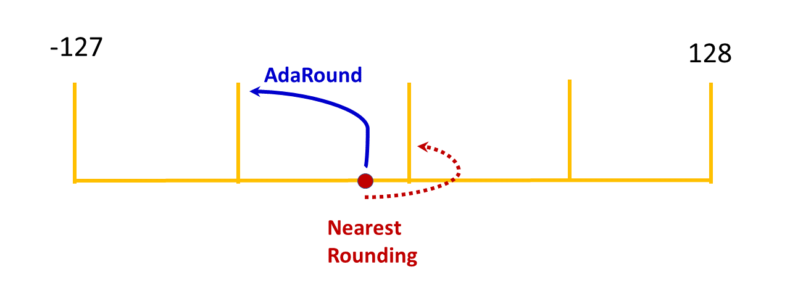

.. _featureguide-adaround:

#################
Adaptive rounding
#################

Context
=======

By default, AIMET uses *nearest rounding* for quantization, in which weight values are quantized to the nearest integer value. 

However, adaptive rounding (AdaRound) uses training data to choose how to round quantized weights. This rounding technique improves the quantized model's accuracy in many cases. You can learn more about adaptive rounding `here <https://arxiv.org/pdf/2004.10568>`_.

The following figures illustrates how AdaRound might change the rounding of a quantized value.

See the :doc:`Optimization User Guide <../opt-guide/index>` for a discussion of the recommended sequence of all quantization techniques.

Complementary techniques
------------------------

As a standalone, AdaRound can yield a significant improvement in performance. If you'd like to layer other techniques with AdaRound, it is recommended to apply AdaRound: 

- After batch norm folding (BNF) and cross layer equalization (CLE): Applying these techniques first can improve the accuracy gained using AdaRound.
- Before quantization aware training (QAT): AdaRound is a better weights initialization step that speeds up QAT

Hyper parameters
----------------

A number of hyper parameters used during AdaRound optimization are exposed in the API. The default values of some of these parameters tend to lead to stable results and we recommend that you not change them.

Use the following guideline for adjusting hyper parameters with AdaRound.

Hyper Parameters to be changed at will
    - Number of batches. AdaRound should see 500-1000 images. Loader batch size times number of batches gives the number of images. For example if the data loader batch size is 64, set 16  batches to yield 1024 images.
    - Number of iterations. Default is 10,000.

Hyper Parameters to be changed with caution
    Regularization parameter. Default is 0.01.

Hyper Parameters to avoid changing
    - Beta range. Leave the value at the default of (20, 2).
    - Warm start period. Leave at the default value, 20%.
  
You can learn more about the AdaRound parameters :doc:`here <../apiref/torch/adaround.rst>`

Workflow
========

Prerequisites
-------------

To use AdaRound, you must:

- Load a trained model
- Create a training or validation dataloader for the model

Workflow
--------

Setup
~~~~~~

.. tab-set::
    :sync-group: platform

    .. tab-item:: PyTorch
        :sync: torch

        .. literalinclude:: ../snippets/torch/apply_adaround.py
            :language: python
            :start-after: [setup]
            :end-before: [step_1]

    .. tab-item:: TensorFlow
        :sync: tf

        .. container:: tab-heading

            Load the model for adaptive rounding (AdaRound). In this code example, we will use MobileNetV2

        .. literalinclude:: ../snippets/tensorflow/apply_adaround.py
            :language: python
            :start-after: # pylint: disable=missing-docstring
            :end-before: # End of model

        **Output**
        ::

            Model: "mobilenetv2_1.00_224"
            __________________________________________________________________________________________________
             Layer (type)                   Output Shape         Param #     Connected to
            ==================================================================================================
             input_1 (InputLayer)           [(None, 224, 224, 3  0           []
                                            )]

             Conv1 (Conv2D)                 (None, 112, 112, 32  864         ['input_1[0][0]']
                                            )

             bn_Conv1 (BatchNormalization)  (None, 112, 112, 32  128         ['Conv1[0][0]']
                                            )

             Conv1_relu (ReLU)              (None, 112, 112, 32  0           ['bn_Conv1[0][0]']
                                            )

             expanded_conv_depthwise (Depth  (None, 112, 112, 32  288        ['Conv1_relu[0][0]']
             wiseConv2D)                    )
             ...

        .. container:: tab-heading

            For AdaRound optimization, an unlabeled dataset is required.
            In this example, we will use the ImageNet validation data.

        .. literalinclude:: ../snippets/tensorflow/apply_adaround.py
            :language: python
            :start-after: # Set up dataset
            :end-before: # End of dataset

    .. tab-item:: ONNX
        :sync: onnx

        .. container:: tab-heading

            Load the model for adaptive rounding (AdaRound). In this code example, we will convert PyTorch MobileNetV2 to ONNX and use it in the subsequent code

        .. literalinclude:: ../snippets/onnx/apply_adaround.py
            :language: python
            :start-after: # Set up model
            :end-before: # End of model

        .. container:: tab-heading

            For AdaRound optimization, an unlabeled dataset is required.
            In this example, we will use the ImageNet validation data.

        .. literalinclude:: ../snippets/onnx/apply_adaround.py
            :language: python
            :start-after: # Set up dataloader
            :end-before: # End of dataloader

Step 1
~~~~~~

Apply AdaRound to the model.

.. tab-set::
    :sync-group: platform

    .. tab-item:: PyTorch
        :sync: torch

        .. literalinclude:: ../snippets/torch/apply_adaround.py
            :language: python
            :start-after: [step_1]
            :end-before: [step_2]

    .. tab-item:: TensorFlow
        :sync: tf

        .. literalinclude:: ../snippets/tensorflow/apply_adaround.py
            :language: python
            :start-after: # Step 1
            :end-before: # End of step 1

    .. tab-item:: ONNX
        :sync: onnx

        .. literalinclude:: ../snippets/onnx/apply_adaround.py
            :language: python
            :start-after: # Step 1
            :end-before: # End of step 1

Step 2
~~~~~~

Simulate quantization through AIMET's QuantSim

.. tab-set::
    :sync-group: platform

    .. tab-item:: PyTorch
        :sync: torch

        .. literalinclude:: ../snippets/torch/apply_adaround.py
            :language: python
            :start-after: [step_2]
            :end-before: [step_3]

    .. tab-item:: TensorFlow
        :sync: tf

        .. literalinclude:: ../snippets/tensorflow/apply_adaround.py
            :language: python
            :start-after: # Step 2
            :end-before: # End of step 2

    .. tab-item:: ONNX
        :sync: onnx

        .. literalinclude:: ../snippets/onnx/apply_adaround.py
            :language: python
            :start-after: # Step 2
            :end-before: # End of step 2

Step 3
~~~~~~

Run evaluation on the model, which will yield its accuracy. 

.. tab-set::
    :sync-group: platform

    .. tab-item:: PyTorch
        :sync: torch

        .. literalinclude:: ../snippets/torch/apply_adaround.py
            :language: python
            :start-after: [step_3]
            :end-before: [step_4]

    .. tab-item:: TensorFlow
        :sync: tf

        .. literalinclude:: ../snippets/tensorflow/apply_adaround.py
            :language: python
            :start-after: # Step 3
            :end-before: # End of step 3

    .. tab-item:: ONNX
        :sync: onnx

        .. literalinclude:: ../snippets/onnx/apply_adaround.py
            :language: python
            :start-after: # Step 3
            :end-before: # End of step 3

Step 4
~~~~~~

If AdaRound resulted in satisfactory accuracy, export the model.

.. tab-set::
    :sync-group: platform

    .. tab-item:: PyTorch
        :sync: torch

        .. literalinclude:: ../snippets/torch/apply_adaround.py
            :language: python
            :start-after: [step_4]

    .. tab-item:: TensorFlow
        :sync: tf

        .. literalinclude:: ../snippets/tensorflow/apply_adaround.py
            :language: python
            :start-after: # Step 4
            :end-before: # End of step 4

    .. tab-item:: ONNX
        :sync: onnx

        .. literalinclude:: ../snippets/onnx/apply_adaround.py
            :language: python
            :start-after: # Step 4
            :end-before: # End of step 4

If the model is still not accurate enough, the next step is typically to try :ref:`quantization-aware training <featureguide-qat>`.

API
===

.. tab-set::
    :sync-group: platform

    .. tab-item:: PyTorch
        :sync: torch

        .. include:: ../apiref/torch/adaround.rst
            :start-after: # start-after

    .. tab-item:: TensorFlow
        :sync: tf

        .. include:: ../apiref/tensorflow/adaround.rst
           :start-after: # start-after

    .. tab-item:: ONNX
        :sync: onnx

        .. include:: ../apiref/onnx/adaround.rst
           :start-after: # start-after

